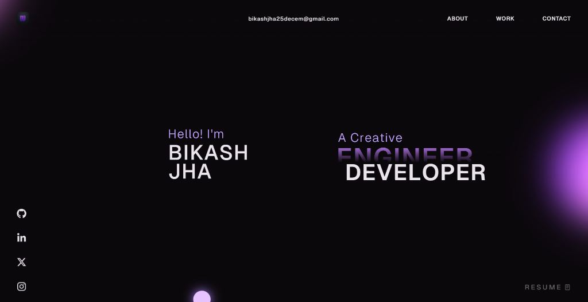

# Bikash Jha - Developer Portfolio 🚀

Personal developer portfolio website built with **React**, **TypeScript**, **GSAP**, and **Vite**.

---

## 🛠️ Features & Highlights

- **Modern & Responsive UI:** Sleek dark design with custom typography and subtle background gradients.
- **Smooth Animations:** Integrated GSAP and ScrollSmoother for fluid section transitions.
- **Projects Showcase:** Highlights key projects including Mumzworld AI Comparator, DevTube, and NetflixGPT.
- **Interactive Tech Stack:** Visual tech stack representations built with React & Three.js physics elements.
- **Fast Performance:** Optimized render loops and lazy-loaded components.

---

## ⚙️ Tech Stack

- **Frontend:** React, TypeScript, HTML5, CSS3, Tailwind CSS
- **Animations:** GSAP, ScrollSmoother, ScrollTrigger
- **Graphics & 3D:** Three.js, React Three Fiber
- **Build & Tools:** Vite, npm, Git, Vercel

---

## 📄 Contact & Links

- **Email:** [bikashjha25decem@gmail.com](mailto:bikashjha25decem@gmail.com)
- **GitHub:** [github.com/bikash-jha25](https://github.com/bikash-jha25)
- **LinkedIn:** [linkedin.com/in/bikash-jha-652511349](https://www.linkedin.com/in/bikash-jha-652511349/)
- **LeetCode:** [leetcode.com/u/bikash_jha25](https://leetcode.com/u/bikash_jha25/)

---

## 📄 License

This repository is shared for learning and reference purposes.
